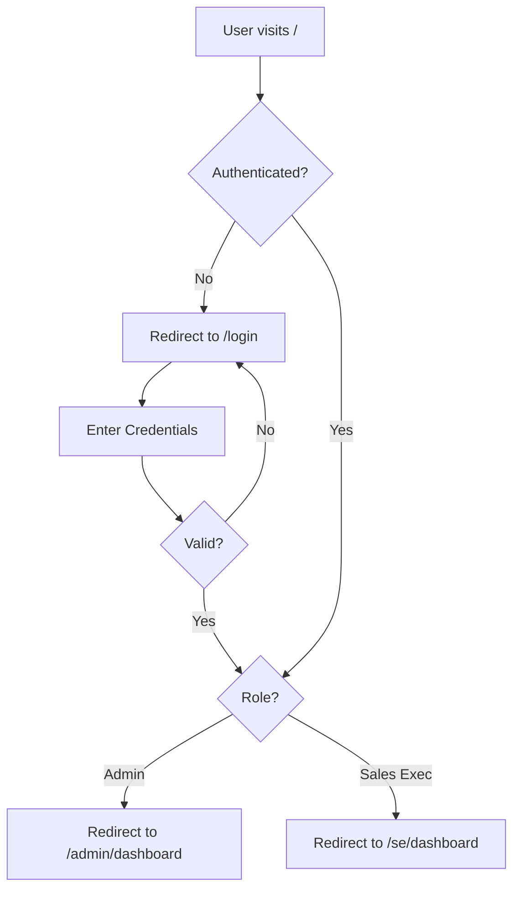
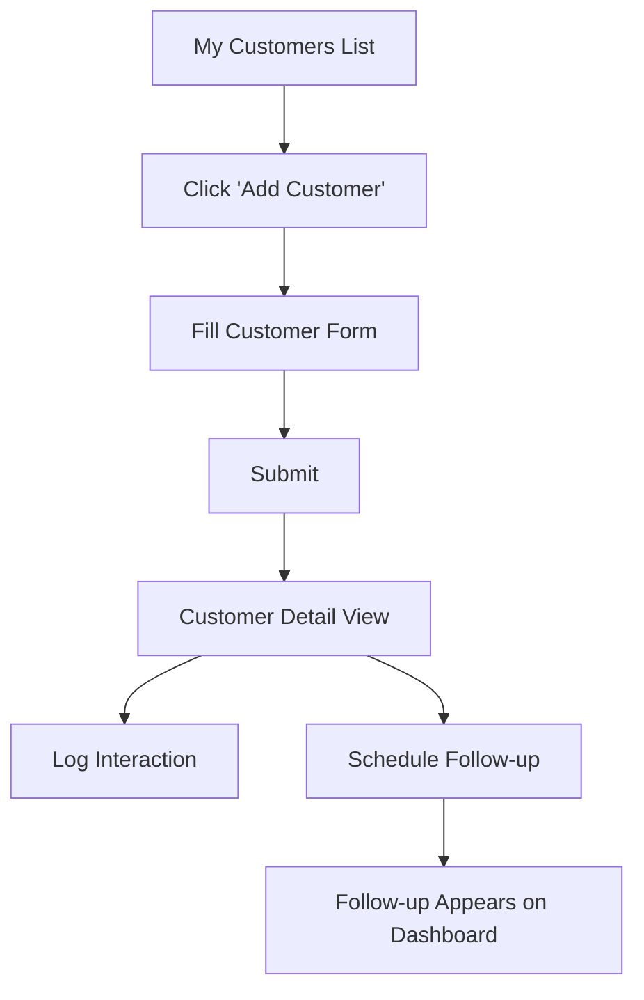
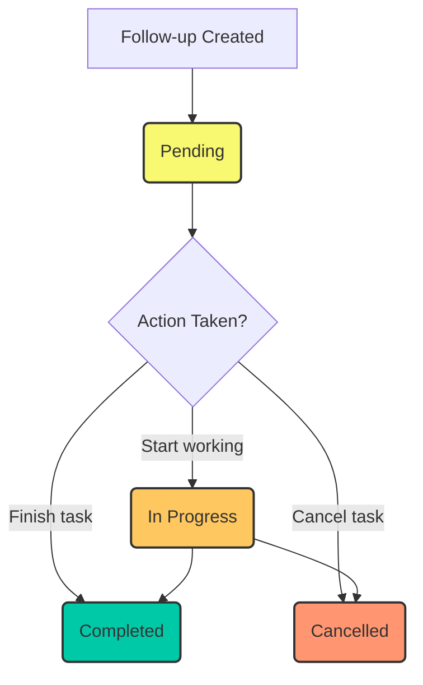

# Phase 2 — UX Design, User Flows & Screen Planning

## Objective
Define every screen, user flow, and navigation structure for the CRM application before beginning UI development. This document acts as the blueprint for the frontend implementation and ensures all requirements from Phase 1 have corresponding UI elements.

---

## 1. Screen Inventory

### Common Screens
- **Login Screen (`/login`)**: Authentication entry point for all users.
- **Unauthorized Screen (`/unauthorized`)**: Fallback screen for 403 Forbidden errors.
- **Not Found Screen (`/404`)**: Fallback screen for non-existent routes.

### Admin Screens
- **Admin Dashboard (`/admin/dashboard`)**: System-wide overview with key metrics.
- **User Management**
  - **User List (`/admin/users`)**: Table view of all Sales Executives.
  - **Create User (`/admin/users/new`)**: Form to create a new SE.
  - **Edit User (`/admin/users/:id/edit`)**: Form to edit an existing SE.
  - **User Detail (`/admin/users/:id`)**: Read-only view of a specific SE's profile.
- **Customer Management (System-wide)**
  - **All Customers (`/admin/customers`)**: Table view of all customers in the system.
  - **Customer Detail (`/admin/customers/:id`)**: Deep view including assignment info, interactions, and follow-ups.
  - **Edit Customer (`/admin/customers/:id/edit`)**: Form to edit a customer (includes Reassign capability).
- **Global Views**
  - **All Follow-ups (`/admin/follow-ups`)**: List/Filter view of follow-ups across the system.
  - **All Interactions (`/admin/interactions`)**: Timeline view of interactions across the system.

### Sales Executive Screens
- **SE Dashboard (`/se/dashboard`)**: Personal overview (My Customers, upcoming follow-ups).
- **Customer Management (Assigned)**
  - **My Customers (`/se/customers`)**: Table view of assigned customers.
  - **Customer Detail (`/se/customers/:id`)**: Deep view showing customer info, interaction timeline, and follow-ups.
  - **Create Customer (`/se/customers/new`)**: Form to add a new customer (auto-assigned).
  - **Edit Customer (`/se/customers/:id/edit`)**: Form to edit assigned customer info.
- **Follow-up Management**
  - **My Follow-ups (`/se/follow-ups`)**: List view of personal follow-ups with status filters.
- **Profile**
  - **My Profile (`/se/profile`)**: View and edit own basic info (Name, Phone).

---

## 2. Navigation Structure

The application will use a **Sidebar Navigation** layout for authenticated users, with a top header containing the user profile/logout actions.

### Admin Sidebar Navigation
- 📊 Dashboard (`/admin/dashboard`)
- 👥 Users (`/admin/users`)
- 🏢 All Customers (`/admin/customers`)
- 📅 All Follow-ups (`/admin/follow-ups`)
- 📞 All Interactions (`/admin/interactions`)

### Sales Executive Sidebar Navigation
- 📊 Dashboard (`/se/dashboard`)
- 🤝 My Customers (`/se/customers`)
- 📅 My Follow-ups (`/se/follow-ups`)
- ⚙️ Settings / Profile (`/se/profile`)

---

## 3. User Flow Diagrams

### Authentication Flow

### Customer Lifecycle Flow (Sales Executive)

### Follow-up Lifecycle Flow

---

## 4. Form Structures & Validation

### User Form (Create/Edit)
| Field | UI Element | Validation | Notes |
|-------|------------|------------|-------|
| Name | Text Input | Required, 2-100 chars | |
| Email | Email Input| Required, valid email format | Must be unique |
| Phone | Text Input | Optional, valid phone format | |
| Role | Select | Required | Admin only field. Options: Admin, Sales Executive |
| Password | Password | Required (Create), Hidden (Edit) | Min 8 chars |

### Customer Form (Create/Edit)
| Field | UI Element | Validation | Notes |
|-------|------------|------------|-------|
| Name | Text Input | Required, 2-100 chars | |
| Email | Email Input| Required, valid email format | Must be unique |
| Phone | Text Input | Required, valid phone format | |
| Address | Textarea | Optional, max 500 chars | |
| Assigned To | Select | Required | Admin only field. SE form auto-assigns hidden. |

### Follow-up Form (Create/Edit)
| Field | UI Element | Validation | Notes |
|-------|------------|------------|-------|
| Customer | Select/Search| Required | Pre-filled if opened from Customer Detail |
| Date & Time| DateTime Picker| Required, Valid future date | |
| Notes | Textarea | Optional, max 1000 chars | |
| Status | Select | Required | Pending (Default), In Progress, Completed, Cancelled |

### Interaction Form (Log)
| Field | UI Element | Validation | Notes |
|-------|------------|------------|-------|
| Customer | Select/Search| Required | Pre-filled if opened from Customer Detail |
| Type | Select | Required | Call, Email, Meeting |
| Date & Time| DateTime Picker| Required | Defaults to 'Now' |
| Summary | Text Input | Required, 2-200 chars | Serves as timeline headline |
| Notes | Textarea | Optional, max 2000 chars | |
| Duration | Number Input | Optional, Positive integer | In minutes |

---

## 5. Dashboard Layouts

### Sales Executive Dashboard Layout

1. **Top Row (Summary Cards)**
   - My Customers Count
   - Pending Follow-ups Count
   - Completed Follow-ups Count

2. **Main Content Area (Split View)**
   - **Left Column: Action Items**
     - **Overdue Follow-ups**: Highlighted list of past-due items with quick-action "Update Status" buttons.
     - **Upcoming Follow-ups**: List of follow-ups due in the next 7 days.
   - **Right Column: Recent Activity**
     - **Recent Interactions**: Timeline view of the last 5-10 interactions logged.

### Admin Dashboard Layout

1. **Top Row (System KPIs)**
   - Total Customers
   - Total Sales Executives
   - Total Interactions

2. **Middle Row (Follow-up Health)**
   - Chart/Summary: Follow-ups by Status (Pending vs In Progress vs Completed)
   - **Overdue Follow-ups Metric**: Count of overdue follow-ups system-wide.

3. **Bottom Row (Team Performance)**
   - **Sales Executive Summary Table**: List of SEs with their assigned customer count and open follow-up count.

---

## STATUS

## Plan: ✅ Complete
## Implementation: ✅ Complete (documentation phase — no code)
## Testing: N/A (no code to test)
## Review: ✅ Complete
## Documentation: ✅ This document
